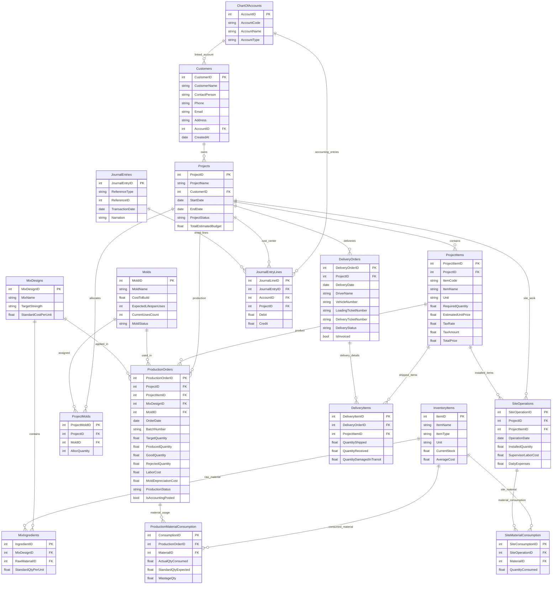

```mermaid
erDiagram

ChartOfAccounts {
    int AccountID PK
    string AccountCode
    string AccountName
    string AccountType
}

Customers {
    int CustomerID PK
    string CustomerName
    string ContactPerson
    string Phone
    string Email
    string Address
    int AccountID FK
    date CreatedAt
}

Projects {
    int ProjectID PK
    string ProjectName
    int CustomerID FK
    date StartDate
    date EndDate
    string ProjectStatus
    float TotalEstimatedBudget
}

ProjectItems {
    int ProjectItemID PK
    int ProjectID FK
    string ItemCode
    string ItemName
    string Unit
    float RequiredQuantity
    float EstimatedUnitPrice
    float TaxRate
    float TaxAmount
    float TotalPrice
}

InventoryItems {
    int ItemID PK
    string ItemName
    string ItemType
    string Unit
    float CurrentStock
    float AverageCost
}

Molds {
    int MoldID PK
    string MoldName
    float CostToBuild
    int ExpectedLifespanUses
    int CurrentUsesCount
    string MoldStatus
}

ProjectMolds {
    int ProjectMoldID PK
    int ProjectID FK
    int MoldID FK
    int AllocQuantity
}

MixDesigns {
    int MixDesignID PK
    string MixName
    string TargetStrength
    float StandardCostPerUnit
}

MixIngredients {
    int IngredientID PK
    int MixDesignID FK
    int RawMaterialID FK
    float StandardQtyPerUnit
}

ProductionOrders {
    int ProductionOrderID PK
    int ProjectID FK
    int ProjectItemID FK
    int MixDesignID FK
    int MoldID FK
    date OrderDate
    string BatchNumber
    float TargetQuantity
    float ProducedQuantity
    float GoodQuantity
    float RejectedQuantity
    float LaborCost
    float MoldDepreciationCost
    string ProductionStatus
    bool IsAccountingPosted
}

ProductionMaterialConsumption {
    int ConsumptionID PK
    int ProductionOrderID FK
    int MaterialID FK
    float ActualQtyConsumed
    float StandardQtyExpected
    float WastageQty
}

DeliveryOrders {
    int DeliveryOrderID PK
    int ProjectID FK
    date DeliveryDate
    string DriverName
    string VehicleNumber
    string LoadingTicketNumber
    string DeliveryTicketNumber
    string DeliveryStatus
    bool IsInvoiced
}

DeliveryItems {
    int DeliveryItemID PK
    int DeliveryOrderID FK
    int ProjectItemID FK
    float QuantityShipped
    float QuantityReceived
    float QuantityDamagedInTransit
}

SiteOperations {
    int SiteOperationID PK
    int ProjectID FK
    int ProjectItemID FK
    date OperationDate
    float InstalledQuantity
    float SupervisorLaborCost
    float DailyExpenses
}

SiteMaterialConsumption {
    int SiteConsumptionID PK
    int SiteOperationID FK
    int MaterialID FK
    float QuantityConsumed
}

JournalEntries {
    int JournalEntryID PK
    string ReferenceType
    int ReferenceID
    date TransactionDate
    string Narration
}

JournalEntryLines {
    int JournalLineID PK
    int JournalEntryID FK
    int AccountID FK
    int ProjectID FK
    float Debit
    float Credit
}

ChartOfAccounts ||--o{ Customers : linked_account
ChartOfAccounts ||--o{ JournalEntryLines : accounting_entries

Customers ||--o{ Projects : owns

Projects ||--o{ ProjectItems : contains
Projects ||--o{ ProjectMolds : allocates
Projects ||--o{ ProductionOrders : production
Projects ||--o{ DeliveryOrders : deliveries
Projects ||--o{ SiteOperations : site_work
Projects ||--o{ JournalEntryLines : cost_center

ProjectItems ||--o{ ProductionOrders : product
ProjectItems ||--o{ DeliveryItems : shipped_items
ProjectItems ||--o{ SiteOperations : installed_items

Molds ||--o{ ProjectMolds : assigned
Molds ||--o{ ProductionOrders : used_in

MixDesigns ||--o{ MixIngredients : contains
MixDesigns ||--o{ ProductionOrders : applied_in

InventoryItems ||--o{ MixIngredients : raw_material
InventoryItems ||--o{ ProductionMaterialConsumption : consumed_material
InventoryItems ||--o{ SiteMaterialConsumption : site_material

ProductionOrders ||--o{ ProductionMaterialConsumption : material_usage

DeliveryOrders ||--o{ DeliveryItems : delivery_details

SiteOperations ||--o{ SiteMaterialConsumption : material_consumption

JournalEntries ||--o{ JournalEntryLines : entry_lines
```
