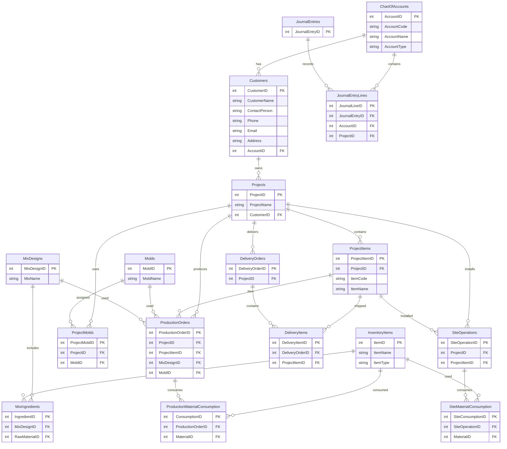

```mermaid
erDiagram

ChartOfAccounts {
    int AccountID PK
    string AccountCode
    string AccountName
    string AccountType
}

Customers {
    int CustomerID PK
    string CustomerName
    string ContactPerson
    string Phone
    string Email
    string Address
    int AccountID FK
}

Projects {
    int ProjectID PK
    string ProjectName
    int CustomerID FK
}

ProjectItems {
    int ProjectItemID PK
    int ProjectID FK
    string ItemCode
    string ItemName
}

InventoryItems {
    int ItemID PK
    string ItemName
    string ItemType
}

Molds {
    int MoldID PK
    string MoldName
}

ProjectMolds {
    int ProjectMoldID PK
    int ProjectID FK
    int MoldID FK
}

MixDesigns {
    int MixDesignID PK
    string MixName
}

MixIngredients {
    int IngredientID PK
    int MixDesignID FK
    int RawMaterialID FK
}

ProductionOrders {
    int ProductionOrderID PK
    int ProjectID FK
    int ProjectItemID FK
    int MixDesignID FK
    int MoldID FK
}

ProductionMaterialConsumption {
    int ConsumptionID PK
    int ProductionOrderID FK
    int MaterialID FK
}

DeliveryOrders {
    int DeliveryOrderID PK
    int ProjectID FK
}

DeliveryItems {
    int DeliveryItemID PK
    int DeliveryOrderID FK
    int ProjectItemID FK
}

SiteOperations {
    int SiteOperationID PK
    int ProjectID FK
    int ProjectItemID FK
}

SiteMaterialConsumption {
    int SiteConsumptionID PK
    int SiteOperationID FK
    int MaterialID FK
}

JournalEntries {
    int JournalEntryID PK
}

JournalEntryLines {
    int JournalLineID PK
    int JournalEntryID FK
    int AccountID FK
    int ProjectID FK
}

ChartOfAccounts ||--o{ Customers : has
ChartOfAccounts ||--o{ JournalEntryLines : contains

Customers ||--o{ Projects : owns

Projects ||--o{ ProjectItems : contains
Projects ||--o{ ProjectMolds : uses
Projects ||--o{ ProductionOrders : produces
Projects ||--o{ DeliveryOrders : delivers
Projects ||--o{ SiteOperations : installs

ProjectItems ||--o{ ProductionOrders : item
ProjectItems ||--o{ DeliveryItems : shipped
ProjectItems ||--o{ SiteOperations : installed

Molds ||--o{ ProjectMolds : assigned
Molds ||--o{ ProductionOrders : used

MixDesigns ||--o{ MixIngredients : includes
MixDesigns ||--o{ ProductionOrders : used

InventoryItems ||--o{ MixIngredients : material
InventoryItems ||--o{ ProductionMaterialConsumption : consumed
InventoryItems ||--o{ SiteMaterialConsumption : used

ProductionOrders ||--o{ ProductionMaterialConsumption : consumes

DeliveryOrders ||--o{ DeliveryItems : contains

SiteOperations ||--o{ SiteMaterialConsumption : consumes

JournalEntries ||--o{ JournalEntryLines : records
```
