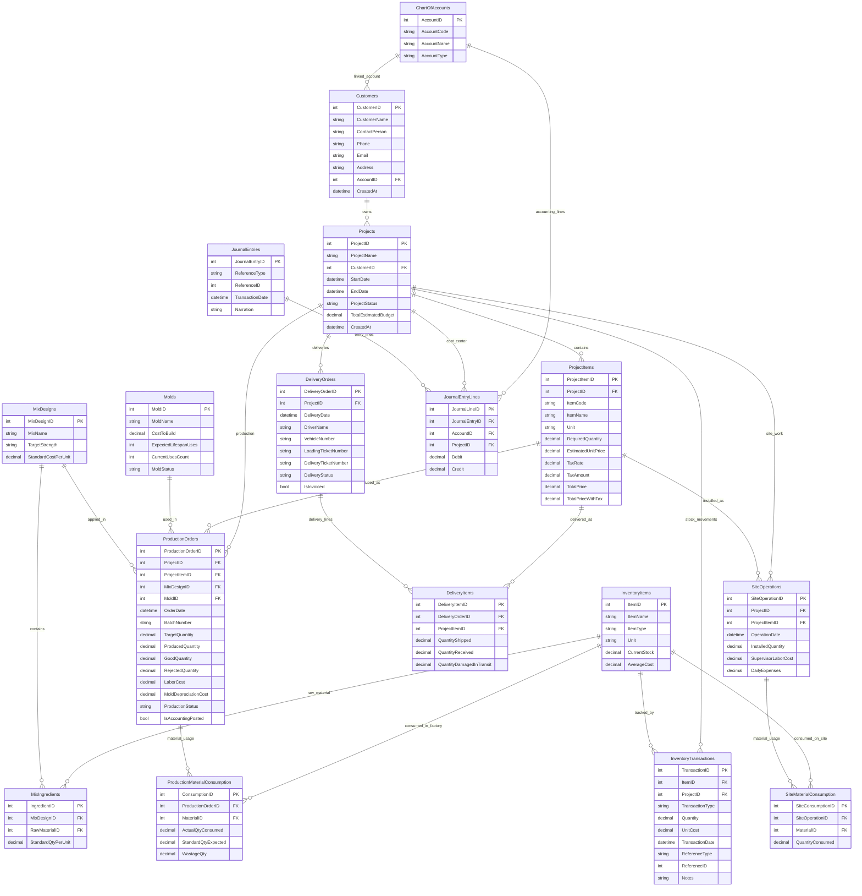

# ERP Factory System ERD

## Reporting Views

- `ProjectCostSummary`: summarizes project estimated budget, production direct cost, site direct cost, and total direct cost.
- `JournalEntryBalance`: summarizes debit, credit, and balance difference for each journal entry.
