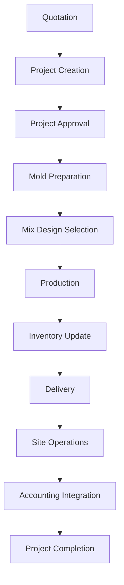

# ERP Manufacturing Workflow

## Overview
This document explains the full end-to-end workflow of the ERP system for a project-based manufacturing factory.  
It connects all modules: Projects, Production, Inventory, Delivery, Site Operations, and Accounting.

---

## 1. Workflow Description

### 1. Quotation & Project Creation
- Customer request is received
- Quotation is prepared
- Project is created in the system
- BOQ (Project Items) is defined

### 2. Project Approval
- Project is reviewed and approved
- Budget is confirmed
- Status becomes Approved

### 3. Mold Preparation
- Required molds are assigned or prepared
- Molds are linked to project

### 4. Mix Design Selection
- Appropriate mix is selected
- Material ratios are defined
- Cost per mix is calculated

### 5. Production
- Production orders are created
- Materials are consumed
- Mold usage is tracked
- Good and rejected quantities are recorded

### 6. Inventory Update
- Raw materials are deducted
- Finished goods are added
- All movements are recorded

### 7. Delivery
- Delivery order is created
- Goods are shipped to site
- Damages (if any) are recorded

### 8. Site Operations
- Items are installed at site
- Daily labor and expenses are recorded
- Site materials are consumed

### 9. Accounting Integration
- All operations generate journal entries
- Costs are linked to project

### 10. Project Completion
- Total cost is calculated
- Profitability is evaluated
- Final project report is generated

---

## 2. Workflow Diagram



---

## 3. Output of System
- Total Project Cost
- Material Consumption
- Waste Analysis
- Mold Efficiency
- Profitability Report
```
