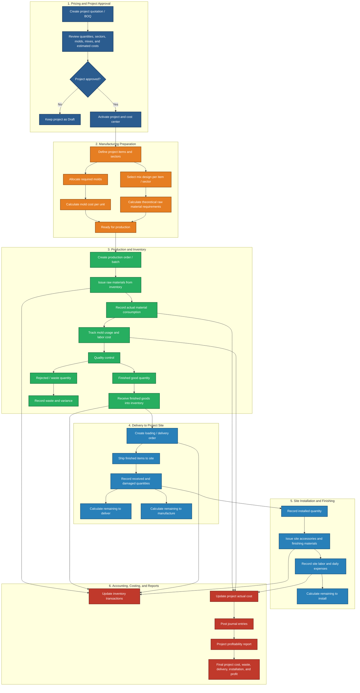

# ERP Factory System Workflow

```mermaid
flowchart TD
    classDef sales fill:#2b5c8f,stroke:#1b3a5d,stroke-width:2px,color:#fff;
    classDef prep fill:#e67e22,stroke:#8f4d12,stroke-width:2px,color:#fff;
    classDef production fill:#27ae60,stroke:#176b3a,stroke-width:2px,color:#fff;
    classDef logistics fill:#2980b9,stroke:#174f77,stroke-width:2px,color:#fff;
    classDef finance fill:#c0392b,stroke:#7b241c,stroke-width:2px,color:#fff;

    subgraph S1["1. Pricing and Project Approval"]
        A["Create project quotation / BOQ"] --> B["Review quantities, sectors, molds, mixes, and estimated costs"]
        B --> C{"Project approved?"}
        C -->|No| D["Keep project as Draft"]
        C -->|Yes| E["Activate project and cost center"]
    end

    subgraph S2["2. Manufacturing Preparation"]
        E --> F["Define project items and sectors"]
        F --> G["Allocate required molds"]
        F --> H["Select mix design per item / sector"]
        G --> I["Calculate mold cost per unit"]
        H --> J["Calculate theoretical raw material requirements"]
        I --> K["Ready for production"]
        J --> K
    end

    subgraph S3["3. Production and Inventory"]
        K --> L["Create production order / batch"]
        L --> M["Issue raw materials from inventory"]
        M --> N["Record actual material consumption"]
        N --> O["Track mold usage and labor cost"]
        O --> P["Quality control"]
        P --> Q["Finished good quantity"]
        P --> R["Rejected / waste quantity"]
        Q --> S["Receive finished goods into inventory"]
        R --> T["Record waste and variance"]
    end

    subgraph S4["4. Delivery to Project Site"]
        S --> U["Create loading / delivery order"]
        U --> V["Ship finished items to site"]
        V --> W["Record received and damaged quantities"]
        W --> X["Calculate remaining to deliver"]
        W --> Y["Calculate remaining to manufacture"]
    end

    subgraph S5["5. Site Installation and Finishing"]
        W --> Z["Record installed quantity"]
        Z --> AA["Issue site accessories and finishing materials"]
        AA --> AB["Record site labor and daily expenses"]
        AB --> AC["Calculate remaining to install"]
    end

    subgraph S6["6. Accounting, Costing, and Reports"]
        M --> AD["Update inventory transactions"]
        S --> AD
        U --> AD
        AA --> AD
        N --> AE["Update project actual cost"]
        O --> AE
        AB --> AE
        AE --> AF["Post journal entries"]
        AF --> AG["Project profitability report"]
        AG --> AH["Final project cost, waste, delivery, installation, and profit"]
    end

    class A,B,C,D,E sales;
    class F,G,H,I,J,K prep;
    class L,M,N,O,P,Q,R,S,T production;
    class U,V,W,X,Y logistics;
    class Z,AA,AB,AC logistics;
    class AD,AE,AF,AG,AH finance;
```
